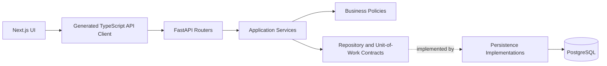
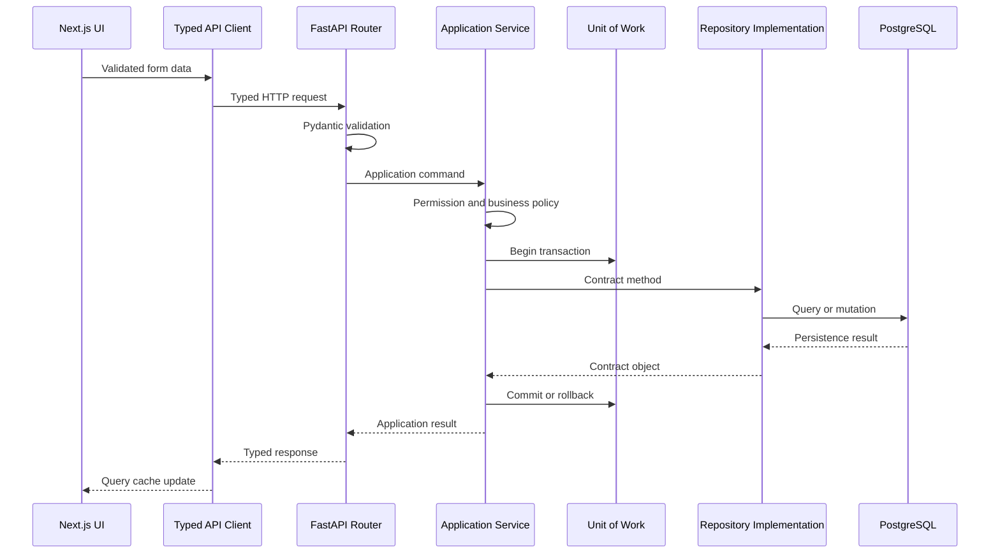
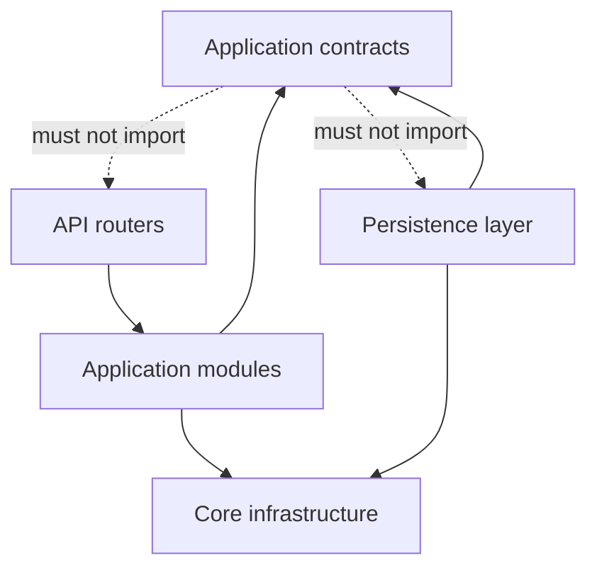
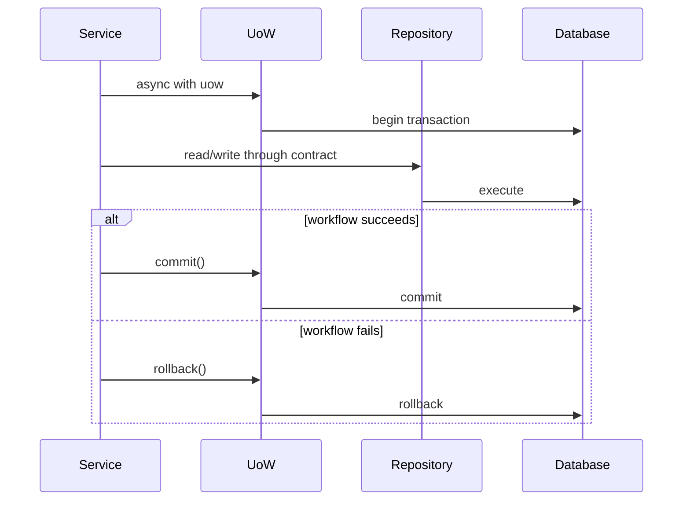

# TransitOps Application Contracts

## Purpose

The application contract layer defines stable vocabulary, validated data shapes, repository behavior,
and transaction ownership for TransitOps. It separates application services from database and HTTP
framework implementation details.

Phase 0 adds contracts and documentation only. It does not add operational routes, database models,
migrations, persistence queries, authentication behavior, or frontend business screens.

## System boundary

## Request lifecycle

## Dependency rules

The `app.contracts` package may import the Python standard library and Pydantic. It must not import
FastAPI, SQLAlchemy, Alembic, `app.api`, or `app.db`.

## Contract responsibilities

- DTOs define transport-neutral validated inputs and outputs.
- Repository protocols describe application-required behavior instead of generic CRUD.
- List methods accept typed filters and return typed pages.
- Explicit methods represent row-locking requirements.
- Repositories never expose sessions, SQL expressions, or ORM models.
- Repositories never commit transactions.
- Services explicitly commit successful workflows through the unit of work.
- Context exit rolls back unfinished or failed work.

## Unit-of-work lifecycle

Automatic commit on context exit is prohibited.

## Validation strategy

- Architecture tests reject forbidden imports.
- Strict mypy checks protocol compatibility.
- Fake repositories and a fake unit of work validate service-facing usability.
- Serialization tests cover UUID, decimal, datetime, date, and enum behavior.
- OpenAPI generation and TypeScript generation are checked for deterministic output.
