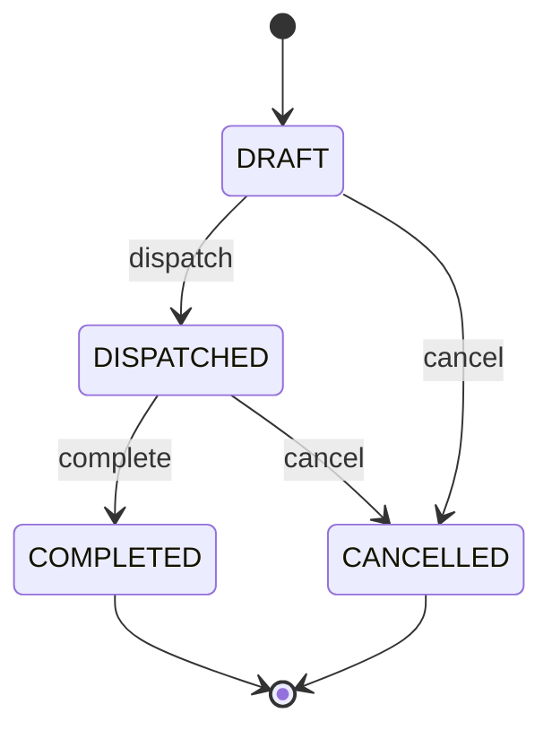
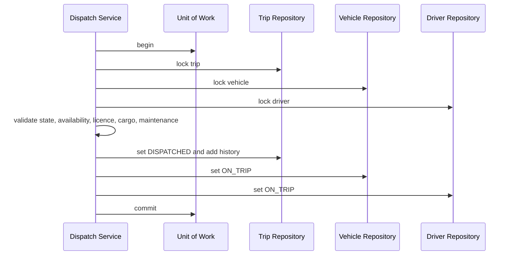

# TransitOps Workflow Rules

## Trip lifecycle

- Completed and cancelled are terminal.
- Generic trip updates cannot change status.
- Only draft trips can be edited or dispatched.
- Dispatched cancellation requires a reason.

## Dispatch transaction

Any validation or persistence failure rolls the complete operation back. The same vehicle or driver
cannot be assigned to more than one dispatched trip.

## Completion

- Trip must be dispatched.
- Final odometer cannot be below the trip start odometer.
- Actual distance is derived by the server.
- Vehicle odometer is updated.
- Trip becomes completed.
- Vehicle and driver return to available.
- Fuel and revenue inputs are recorded consistently.
- Status history and audit records are written in the same transaction.

## Cancellation

- Draft cancellation changes only the trip.
- Dispatched cancellation restores vehicle and driver availability.
- A dispatched cancellation requires a reason.
- Repeated requests with the same idempotency key return the original result.

## Maintenance

- Only an available vehicle can enter active maintenance.
- A vehicle cannot have more than one active maintenance record.
- Opening maintenance changes the vehicle to `IN_SHOP` in the same transaction.
- An in-shop vehicle is not a dispatch candidate.
- Closing maintenance records actual cost and restores the vehicle to `AVAILABLE`.
- A vehicle cannot be retired while on a trip or in active maintenance.

## Driver compliance

- Suspended and off-duty drivers are not dispatch candidates.
- A licence must remain valid on the planned trip start date, or the dispatch date when no plan exists.
- Licence category must be compatible with vehicle type.
- A driver already on a trip cannot be assigned again.

## Odometer integrity

- Operational odometer readings never decrease.
- Actual trip distance is final odometer minus start odometer.
- Fuel and maintenance readings cannot precede the recorded vehicle odometer without an authorized,
  reasoned correction.
- Odometer corrections are audited and use optimistic concurrency.

## Archival

- Operational records with history are archived rather than physically deleted.
- Completed and cancelled trips cannot be deleted.
- Archived resources are excluded from normal lists and dispatch candidates.
